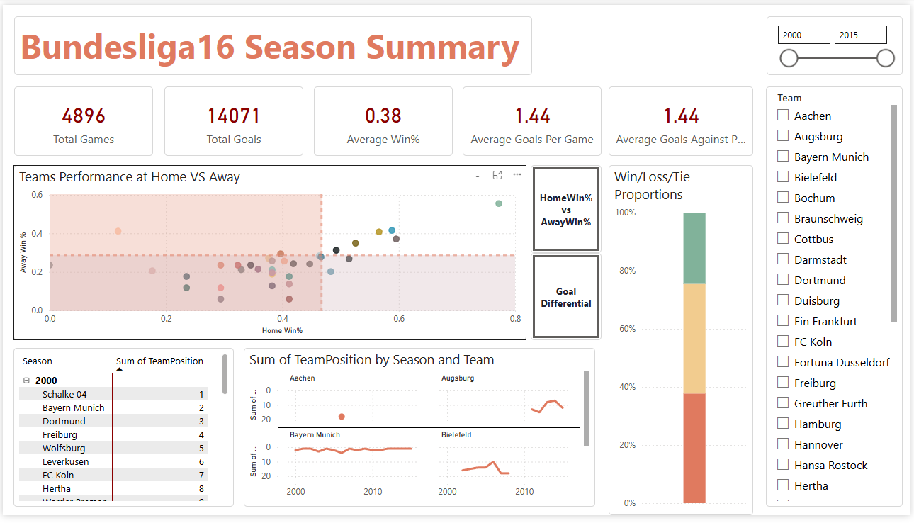

# ⚽ Bundesliga Analytics — PySpark Pipeline

A full end-to-end data engineering and analytics project built with **PySpark**, covering data ingestion, transformation, aggregation, ranking via Window Functions, Parquet export, Python visualization, and a Power BI dashboard.

> **Context:** Simplon Maghreb × Jobintech — Data Analyst Training Program (Jan–Jun 2026)  
> **Duration:** 5 days (18/05/2026 → 22/05/2026)  
> **Mode:** Individual project



---

## 🔗 Notebooks

| Environment | Link |
|---|---|
| Google Colab | [Open in Colab](https://colab.research.google.com/drive/1KT_U4WsD8umE-EWjZnU4k9hHgWoc6d0O?usp=sharing) |
| Databricks (Bonus) | [Open in Databricks](https://dbc-901ab696-4ce5.cloud.databricks.com/editor/notebooks/2708479926592753?o=7474657593396595) |

> Parquet outputs (`football_stats_partitioned` and `football_top_teams`) are stored in Google Drive / Databricks Volumes — paths are parameterized inside each notebook.

---

## 📁 Repository Structure

```
bundesliga-pyspark/
│
├── data/
│   └── ensemble-de-donnees.csv          # Raw football match dataset
│
├── visuals/
│   ├── win_percentage_champions.png
│   ├── goals_scored_champions.png
│   ├── goal_differentials_champions.png
│   └── powerbi_dashboard.png            # Power BI dashboard screenshot
│
├── bundesliga_dashboard.pbix            # Power BI dashboard file
│
└── README.md
```

---

## 🧰 Tech Stack

| Layer | Tools |
|---|---|
| Processing | PySpark (Google Colab + Databricks) |
| Storage | Parquet (partitioned) |
| Visualization | Matplotlib / Pandas `.plot()` |
| Dashboard | Power BI Desktop |
| Version Control | Git / GitHub |

---

## 🔄 Pipeline Overview

### 1. Load & Prepare
- Read raw CSV into a PySpark DataFrame with `inferSchema=True`
- Rename key columns: `FTHG → HomeTeamGoals`, `FTAG → AwayTeamGoals`, `FTR → FinalResult`

### 2. Feature Engineering
- Create binary indicator columns: `HomeTeamWin`, `AwayTeamWin`, `GameTie` using `func.when()`

### 3. Filter
- Keep only **Bundesliga** (`Div == "D1"`)
- Restrict to **seasons 2000–2015**

### 4. Aggregations
- `df_home_matches` — grouped by `HomeTeam` + `Season`: home wins, losses, ties, goals scored/against
- `df_away_matches` — grouped by `AwayTeam` + `Season`: away wins, losses, ties, goals scored/against

### 5. Join
- Rename team columns to `Team`, then inner join both DataFrames on `['Team', 'Season']`

### 6. Derived Metrics

| Column | Formula |
|---|---|
| `GoalsScored` | `HomeScoredGoals + AwayScoredGoals` |
| `GoalsAgainst` | `HomeAgainstGoals + AwayAgainstGoals` |
| `Win / Loss / Tie` | Sum of home + away results |
| `TotalGames` | `Win + Loss + Tie` |
| `GoalDifferentials` | `GoalsScored - GoalsAgainst` |
| `WinPercentage` | `Win / TotalGames` (rounded to 3dp) |
| `GoalsPerGame` | `GoalsScored / TotalGames` (rounded to 3dp) |
| `GoalsAgainstPerGame` | `GoalsAgainst / TotalGames` (rounded to 3dp) |

### 7. Window Ranking
- Window partitioned by `Season`, ordered by `GoalDifferentials DESC` then `WinPercentage DESC`
- `TeamPosition` assigned with `row_number()`

### 8. Export
- `football_stats_partitioned` — all teams, `.partitionBy("Season")`, Parquet format
- `football_top_teams` — `TeamPosition == 1` only, Parquet format

### 9. Visualizations (Matplotlib via Pandas)
Three bar charts generated from `df_parque_top` (champions only):
- **Win Percentage** per season (team labels annotated on bars)
- **Goals Scored** per season
- **Goal Differentials** per season

### 10. Power BI Dashboard
Loaded both Parquet files into Power BI Desktop with the following visuals:
- Scatter plot: Home Win% vs Away Win% (and GoalDiff variant)
- Stacked bar: Win/Loss/Tie proportions
- Table: TeamPosition ranking per season
- Small multiples: TeamPosition trend per team over seasons
- KPI cards: Total Games, Total Goals, Avg Win%, Avg Goals Per Game, Avg Goals Against Per Game
- Season range slicer + Team filter

---

## 📊 DAX Measures (Power BI)

```dax
Average Goals Against Per Game = AVERAGE(football_stats_partitioned[GoalsAgainstPerGame])
Average Goals Per Game         = AVERAGE(football_stats_partitioned[GoalsPerGame])
Average Win%                   = AVERAGE(football_stats_partitioned[WinPercentage])

Away Win% = DIVIDE(
    SUM(football_stats_partitioned[TotalAwayWin]),
    SUM(football_stats_partitioned[TotalAwayWin])
    + SUM(football_stats_partitioned[TotalAwayLoss])
    + SUM(football_stats_partitioned[TotalAwayTie])
)

AwayGoalDiff = SUM(football_stats_partitioned[AwayScoredGoals])
             - SUM(football_stats_partitioned[AwayAgainstGoals])

Home Win% = DIVIDE(
    SUM(football_stats_partitioned[TotalHomeWin]),
    SUM(football_stats_partitioned[TotalHomeWin])
    + SUM(football_stats_partitioned[TotalHomeTie])
    + SUM(football_stats_partitioned[TotalHomeLoss])
)

HomeGoalDiff = SUM(football_stats_partitioned[HomeScoredGoals])
             - SUM(football_stats_partitioned[HomeAgainstGoals])

Total Games  = DIVIDE(SUM(football_stats_partitioned[TotalGames]), 2)
Total Goals  = SUM(football_stats_partitioned[GoalsScored])
```

> **Note on Total Games:** Each match is counted once for the home team and once for the away team, so the raw sum is divided by 2 to get the actual number of matches played.

---

## 🚀 How to Run (Google Colab)

1. Open the [Colab notebook](https://colab.research.google.com/drive/1KT_U4WsD8umE-EWjZnU4k9hHgWoc6d0O?usp=sharing) linked above
2. Mount your Google Drive when prompted
3. Upload `ensemble-de-donnees.csv` from `data/` to `MyDrive/Colab Notebooks/data/`
4. Run all cells — Parquet outputs will be written to your Drive automatically

```python
# Install PySpark if needed
!pip install pyspark

# SparkSession is created inside the notebook
spark = SparkSession.builder.getOrCreate()
```

---

## 🏆 Bonus — Databricks

The pipeline was also replicated on **Databricks** (see `notebooks/databricks_pipeline.py`).

Key differences vs Colab:

| | Google Colab | Databricks |
|---|---|---|
| SparkSession | Created manually | Available as `spark` (built-in) |
| Drive mount | `google.colab.drive` | Volumes (`/Volumes/...`) |
| Display | `display()` / matplotlib | Native `display()` with built-in charts |
| Execution | Sequential cells | Notebook commands (`# COMMAND ----------`) |

---

## ❓ Key Technical Questions

**Why Parquet + partitioning by Season?**  
Parquet is a columnar format that enables efficient filtering and aggregation — reading only the columns needed. Partitioning by `Season` means Power BI or any downstream tool loads only the relevant season folder rather than scanning the entire dataset.

**Why GoalDifferentials first in the ranking, then WinPercentage?**  
Goal differential reflects not just whether a team wins, but by how much — it's a stronger signal of dominance. Using it as the primary sort key, with WinPercentage as a tiebreaker, mirrors how real football leagues determine champions.

**How are the `HomeTeamWin` / `AwayTeamWin` / `GameTie` columns derived?**  
The raw `FTR` column contains `H` (home win), `A` (away win), or `D` (draw). Each is encoded as a binary integer column using `func.when(...).otherwise(0)`, making them directly summable in the `groupBy` aggregations.

---

## 👤 Author

**Hamza Khiar**  
Junior Data Analyst — Simplon Maghreb × Jobintech cohort 2026  
[GitHub](https://github.com/HamzaKhiar) · [LinkedIn](https://linkedin.com/in/hamzakhiar)